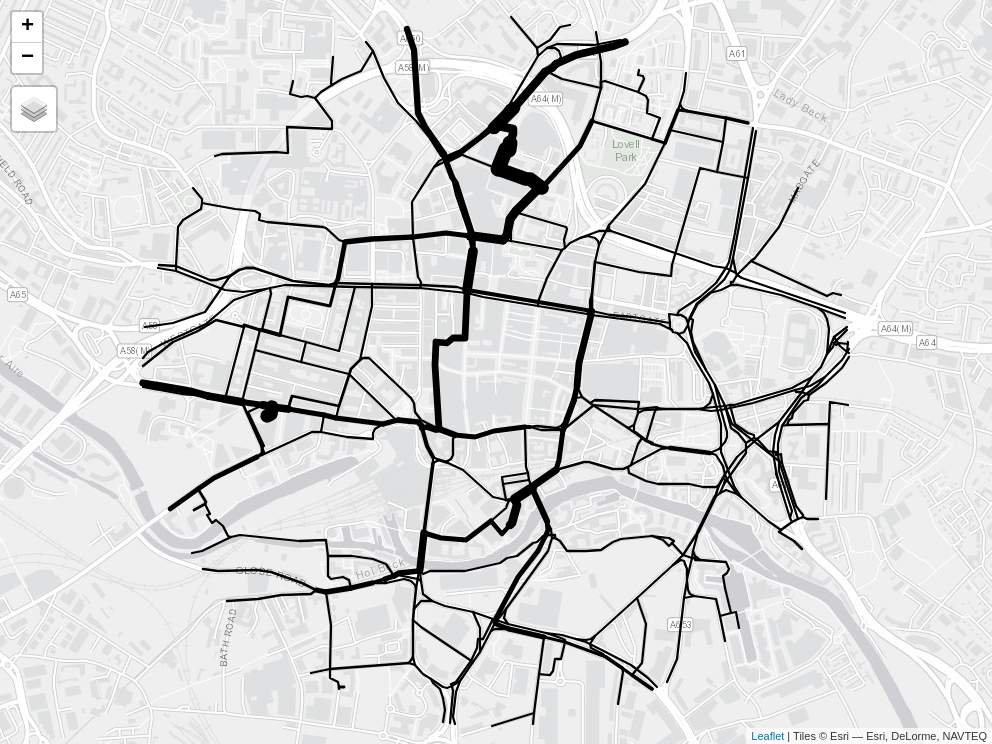

netvis
================

<!-- README.md is generated from README.Rmd. Please edit that file -->
<!-- badges: start -->
<!-- badges: end -->

The goal of this repo is to demonstrate different visualisation
techniques for communicating information about transport networks.

# 1 Example data

We’ll use a route network dataset from the Propensity to Cycle Tool
(PCT) to demonstrate the package. The PCT is a web application that
allows users to explore cycling potential across England and Wales. The
PCT is available at [www.pct.bike](https://www.pct.bike/).

# 2 Static data visualisation

A simple visualisation of the data in a multi-panel static map is shown
below.


# 3 Interactive data visualisation with line widths

The `tmap` package provides a simple way to create interactive maps. The
code below shows how to create an interactive map of the route network
data.


The maximum level of flow in the Go Dutch scenario is 6 times the
maximum level of flow in the baseline scenario. We can use this to scale
the line widths as illustrated below.


There are two problems with line widths in the maps shown above:

- The thinnes lines are too thin
- The thickest lines are too thick

Given that the maximum width is determined by the `scale` argument, we
can solve the first problem by increasing the value of `scale`. The
second problem can be solved with a multiplier that prevents lines being
x times thicker than the thinnest lines, 5 times in this case.



A function that does this work would have the following structure in
Python:

``` python
def scale_line_widths(
    data,
    baseline_column,
    dutch_column,
    maximum_width = 15,
    minimum_width_multiplier = 5
):
    """
    Scale line widths for interactive maps.

    Parameters
    ----------
    data : pandas.DataFrame
        Dataframe containing the data to be plotted.
    baseline_column : str
        Name of the column containing the baseline values.
    dutch_column : str
        Name of the column containing the Go Dutch values.
    maximum_width : int, optional
        Maximum width of the lines in the interactive map. The default is 15.
    minimum_width_multiplier : int, optional
        The minimum width of the lines is the maximum value in the baseline
        data divided by this value. The default is 5.

    Returns
    -------
    data : pandas.DataFrame
        Dataframe with a new column containing the scaled line widths.

    """
    # get 95th percentile of line widths
    combined_values = data[[baseline_column, dutch_column]].quantile(0.95)
    minimum_value_allowed = combined_values[baseline_column] / minimum_width_multiplier
    # scale line widths
    scale = maximum_width / (combined_values[dutch_column] / combined_values[baseline_column])
    data["lwd_dutch"] = data[dutch_column].apply(lambda x: minimum_value_allowed if x < minimum_value_allowed else x)
    data["lwd_bicycle"] = data[baseline_column].apply(lambda x: minimum_value_allowed if x < minimum_value_allowed else x)
    return data, scale
```

Starting with the data in `test-data/rnet_central.geojson` let’s test
this function on a small subset of the data.

``` python
import pandas as pd
import geopandas as gpd
import numpy as np
data = gpd.read_file("test-data/rnet_central.geojson")
data = data[["bicycle", "dutch_slc"]]
data = data.iloc[0:10, :]
data, scale = scale_line_widths(data, "bicycle", "dutch_slc")
print(data)
#>    bicycle  dutch_slc  lwd_dutch  lwd_bicycle
#> 0      1.0      102.0      102.0          1.0
#> 1      2.0       19.0       19.0          2.0
#> 2      2.0       63.0       63.0          2.0
#> 3      3.0       22.0       22.0          3.0
#> 4      3.0      158.0      158.0          3.0
#> 5      3.0      173.0      173.0          3.0
#> 6      4.0       27.0       27.0          4.0
#> 7      4.0      100.0      100.0          4.0
#> 8      4.0      166.0      166.0          4.0
#> 9      5.0       77.0       77.0          5.0
```
