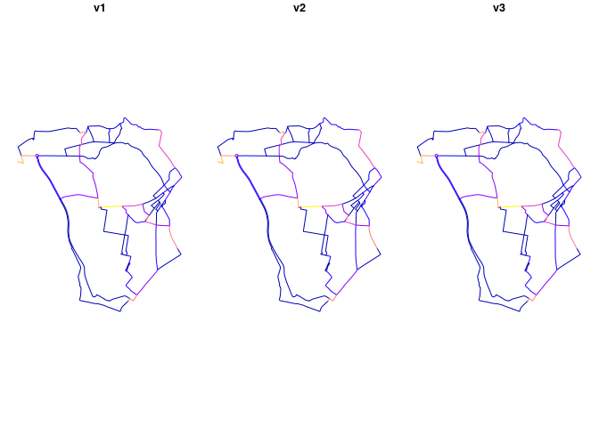

<!-- README.md is generated from README.Rmd. Please edit that file -->

# netvis

<!-- badges: start -->
<!-- badges: end -->

The goal of netvis is to …

## Installation

You can install the development version of netvis from
[GitHub](https://github.com/) with:

``` r
# install.packages("devtools")
devtools::install_github("ITSLeeds/netvis")
```

## Example

We’ll use a route network dataset from the `stplanr` package to
demonstrate network visualisation.

``` r
library(tidyverse)
#> ── Attaching core tidyverse packages ──────────────────────── tidyverse 2.0.0 ──
#> ✔ dplyr     1.1.1     ✔ readr     2.1.4
#> ✔ forcats   1.0.0     ✔ stringr   1.5.0
#> ✔ ggplot2   3.4.1     ✔ tibble    3.2.1
#> ✔ lubridate 1.9.2     ✔ tidyr     1.3.0
#> ✔ purrr     1.0.1     
#> ── Conflicts ────────────────────────────────────────── tidyverse_conflicts() ──
#> ✖ dplyr::filter() masks stats::filter()
#> ✖ dplyr::lag()    masks stats::lag()
#> ℹ Use the conflicted package (<http://conflicted.r-lib.org/>) to force all conflicts to become errors
library(sf)
#> Linking to GEOS 3.11.1, GDAL 3.6.2, PROJ 9.1.1; sf_use_s2() is TRUE
routes_example = stplanr::routes_fast_sf
routes_example$v1 = 1
routes_example$v2 = 2
routes_example$v3 = 10
rnet_example = stplanr::overline(routes_example, attrib = c("v1", "v2", "v3"))
plot(rnet_example)
```



``` r
# usethis::use_data(rnet_example)
```
