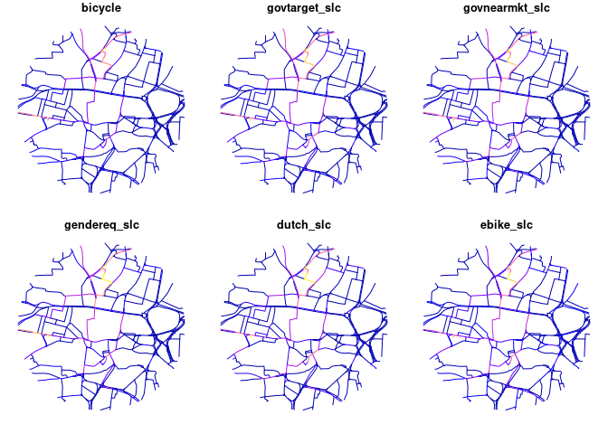

<!-- README.md is generated from README.Rmd. Please edit that file -->

# netvis

<!-- badges: start -->
<!-- badges: end -->

The goal of this repo is to demonstrate different visualisation
techniques for communicating information about transport networks.

<!-- ## Installation
&#10;You can install the development version of netvis from [GitHub](https://github.com/) with:
&#10;-->

## Example

We’ll use a route network dataset from the Propensity to Cycle Tool
(PCT) to demonstrate the package. The PCT is a web application that
allows users to explore cycling potential across England and Wales. The
PCT is available at [www.pct.bike](https://www.pct.bike/).

    #> Deleting source `test-data/rnet_central.geojson' using driver `GeoJSON'
    #> Writing layer `rnet_central' to data source 
    #>   `test-data/rnet_central.geojson' using driver `GeoJSON'
    #> Writing 440 features with 6 fields and geometry type Line String.
