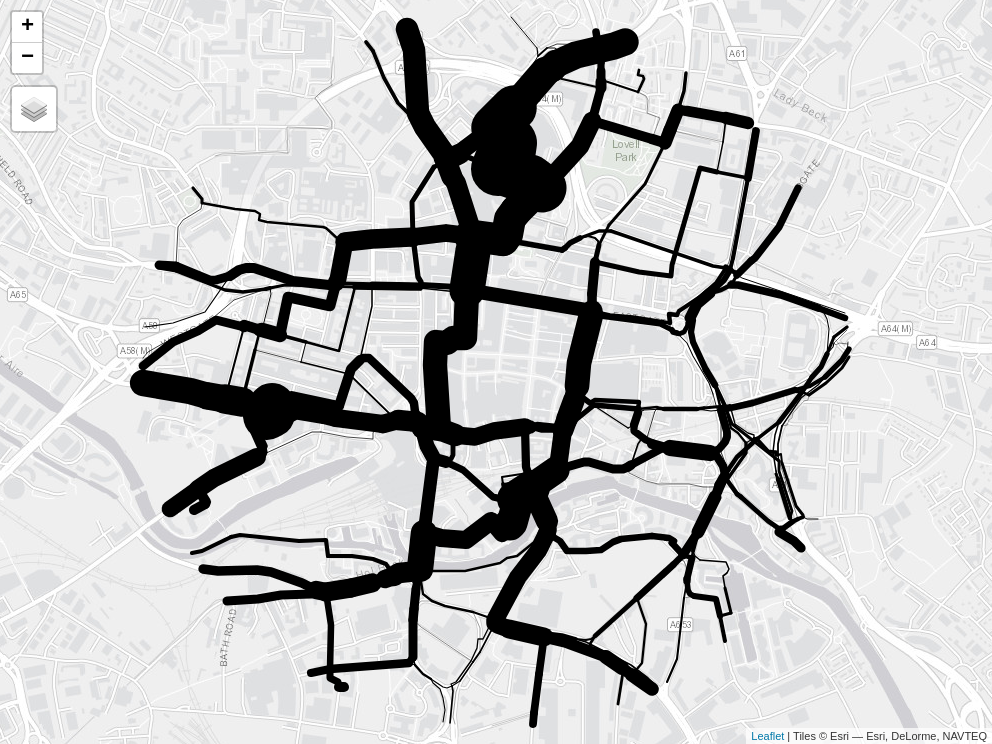

netvis
================

<!-- README.md is generated from README.Rmd. Please edit that file -->
<!-- badges: start -->
<!-- badges: end -->

The goal of this repo is to demonstrate different visualisation
techniques for communicating information about transport networks.

# 1 Example data

We’ll use a route network dataset from the Propensity to Cycle Tool
(PCT) to demonstrate the package. The PCT is a web application that
allows users to explore cycling potential across England and Wales. The
PCT is available at [www.pct.bike](https://www.pct.bike/).

# 2 Static data visualisation

A simple visualisation of the data in a multi-panel static map is shown
below.

# 3 Interactive data visualisation with line widths

The `tmap` package provides a simple way to create interactive maps. The
code below shows how to create an interactive map of the route network
data.

The maximum level of flow in the Go Dutch scenario is 6 times the
maximum level of flow in the baseline scenario. We can use this to scale
the line widths as illustrated below.

There are two problems with line widths in the maps shown above:

- The thinnes lines are too thin
- The thickest lines are too thick

Given that the maximum width is determined by the `scale` argument, we
can solve the first problem by increasing the value of `scale`. The
second problem can be solved with a multiplier that prevents lines being
x times thicker than the thinnest line.

