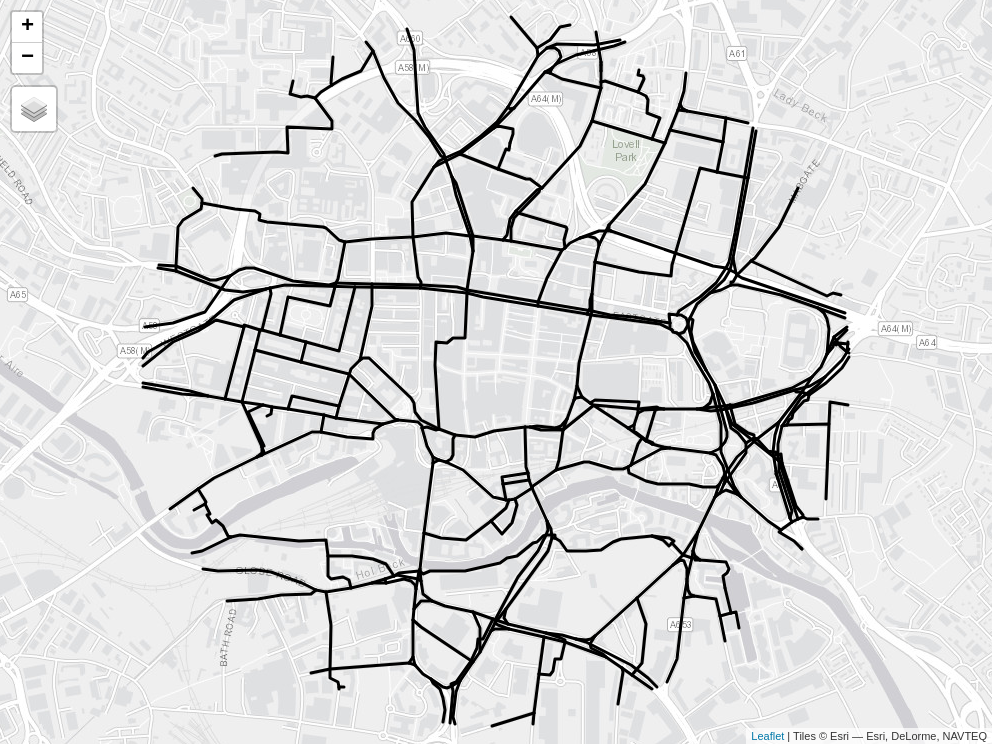

# netvis

- [<span class="toc-section-number">1</span> Example
  data](#example-data)
- [<span class="toc-section-number">2</span> Static data
  visualisation](#static-data-visualisation)
- [<span class="toc-section-number">3</span> Interactive
  maps](#interactive-maps)

<!-- README.md is generated from README.Rmd. Please edit that file -->
<!-- badges: start -->
<!-- badges: end -->

The goal of this repo is to demonstrate different visualisation
techniques for communicating information about transport networks.

# Example data

We’ll use a route network dataset from the Propensity to Cycle Tool
(PCT) to demonstrate the package. The PCT is a web application that
allows users to explore cycling potential across England and Wales. The
PCT is available at [www.pct.bike](https://www.pct.bike/).

We also provide an example dataset from Limerick, Ireland, from the
CRUSE project. This is imported and plotted with code shown below.

``` r
rnet_limerick = sf::read_sf("test-data/rnet_limerick.geojson")
plot(rnet_limerick)
```


# Static data visualisation

A simple visualisation of the data in a multi-panel static map is shown
below.

Read in data for Leeds with the following:

``` r
rnet_central = sf::read_sf("test-data/rnet_central.geojson")
plot(rnet_central)
```


``` r
usethis::use_data(rnet_central, overwrite = TRUE)
```

In Python this would look something like this:

``` python
import geopandas as gpd
rnet_central = gpd.read_file("test-data/rnet_central.geojson")
rnet_central.plot()
```


# Interactive maps

Interactive maps are more engaging and policy-relevant, allowing people
to zoom in and explore results. The images below illustrate interactive
maps of the route network data focussed on the `bicycle` and `dutch_slc`
variables.

The maximum level of flow in the Go Dutch scenario is 6 times the
maximum level of flow in the baseline scenario. We can use this to scale
the line widths as illustrated below.

``` r
m2 = tm_shape(rnet_central) +
  tm_lines(
    lwd = "dutch_slc",
    scale = 9 * width_multiplier
  )
tmap_save(m2, "maps/m2.html")
# browseURL("maps/m2.html")
if(!file.exists("maps/m1.png")) {
  webshot2::webshot("maps/m1.html", "maps/m1.png")
  webshot2::webshot("maps/m2.html", "maps/m2.png")
}
```

<div id="m1-2">

<table>
<colgroup>
<col style="width: 50%" />
<col style="width: 50%" />
</colgroup>
<tbody>
<tr class="odd">
<td style="text-align: center;"><div width="50.0%"
data-layout-align="center">
<p></p>
</div></td>
<td style="text-align: center;"><div width="50.0%"
data-layout-align="center">
<p></p>
</div></td>
</tr>
</tbody>
</table>

</div>

There are two problems with line widths in the maps shown above:

- The thinnes lines are too thin
- The thickest lines are too thick

Given that the maximum width is determined by the `scale` argument, we
can solve the first problem by increasing the value of `scale`. The
second problem can be solved with a multiplier that prevents lines being
x times thicker than the thinnest lines, 5 times in this case.

<div>

<table>
<colgroup>
<col style="width: 50%" />
<col style="width: 50%" />
</colgroup>
<tbody>
<tr class="odd">
<td style="text-align: center;"><div width="50.0%"
data-layout-align="center">
<p></p>
</div></td>
<td style="text-align: center;"><div width="50.0%"
data-layout-align="center">
<p></p>
</div></td>
</tr>
</tbody>
</table>

</div>

A function that does this would look something like this:

``` r
scale_line_widths = function(x, max_width, min_width) {
  # ...
}
```

In the plot below, for example, we increase the thickness of the
thinnest lines by setting `min_width` to 3, making the lines with less
flow more visible.

``` r
m5 = scale_line_widths(x, max_width = 15, min_width = 3)
# m5[[1]]
# m5[[2]]
```

<div>

<table>
<colgroup>
<col style="width: 50%" />
<col style="width: 50%" />
</colgroup>
<tbody>
<tr class="odd">
<td style="text-align: center;"><div width="50.0%"
data-layout-align="center">
<p></p>
</div></td>
<td style="text-align: center;"><div width="50.0%"
data-layout-align="center">
<p></p>
</div></td>
</tr>
</tbody>
</table>

</div>

Instead of showing different layers side-by-side, it’s useful to be able
to select them as different layers interactively. The `netvis()`
function defined in this packages does that, as illustrated below.


<!-- Python attempt: -->
<!-- Starting with the data in `test-data/rnet_central.geojson` let's  test this function on a small subset of the data. -->
